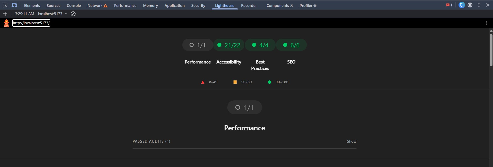

# ModernMart

ModernMart is a React 18 + TypeScript e-commerce front-end assignment built with Vite. The application showcases a complete product browsing experience with a responsive product detail flow, variant selection, a cart drawer, and client-side persistence using Context API and localStorage.

## Features

- Product listing page with product cards
- Product detail page with a primary image and thumbnail gallery
- Color swatches for variant selection
- Size selection with available, low stock, and sold out states
- Quantity picker with stock-aware limits
- Add to Cart flow for the selected variant
- Cart drawer with quantity updates and item removal
- Navbar cart badge for current item count
- Cart persistence through localStorage
- Deep-linkable URLs for selected variant state
- Responsive layout for mobile and desktop screens
- Accessibility-oriented buttons, labels, and keyboard support

## Tech Stack

- React 18
- TypeScript
- Vite
- React Router DOM
- Context API + useReducer
- Axios
- SCSS Modules
- React Icons
- localStorage

## Folder Structure

```text
src/
  components/
    CartDrawer/
    Navbar/
    ProductCard/
  context/
  data/
  hooks/
  pages/
  router/
  services/
  styles/
  types/
```

## Installation

Requirements:
- Node.js 18+
- npm

```bash
git clone <repository-url>
cd ecommerce-app
npm install
npm run dev
```

The development server will start at http://localhost:5173.

## Build

```bash
npm run build
```

## Lint

```bash
npm run lint
```

## Design Decisions

- Context API + useReducer was used for state management because the app only requires a small, predictable global state for cart behavior and drawer visibility.
- Product variant details such as brand, colors, images, sizes, stock, and sale pricing are stored locally because the Fake Store API does not provide those fields.
- SCSS Modules were chosen to keep styling scoped to components while preserving a maintainable and modular structure.
- The application follows a component-based architecture with clear separation between UI, context, services, hooks, and data.
- Product data fetching is isolated in the services layer so the UI remains focused on rendering and interactions.

## Known Trade-offs

- The product data source is a public demo API and does not provide full variant or inventory data.
- Variant information is mocked locally for assignment purposes.
- Cart state is client-side only and does not connect to a backend.
- Inventory updates are not persisted beyond the current client session.

## Lighthouse

The project has been optimized with attention to:

- Performance
- Accessibility
- Best Practices
- SEO

A Lighthouse report screenshot can be added under:

```text
docs/ 

## Lighthouse


```

## Future Improvements

Possible next steps for the project include:

- Unit and integration testing
- Product search and filtering
- Pagination and sorting
- Wishlist support
- Authentication and checkout flow
- Backend integration for real inventory and cart persistence
- Advanced image optimization

## Live Demo

- Live URL: https://modern-mart-ivory.vercel.app/
- GitHub Repository: (https://github.com/rajak82001/ModernMart)

## Author

- Name: Raja Khan
- GitHub: https://github.com/rajak82001
